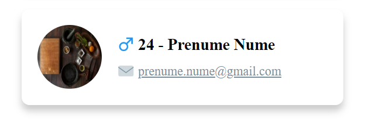
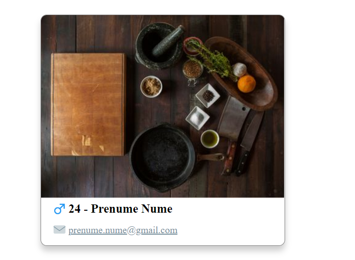

# 1) Starting a new React Project
This chapter goes through setting up a new React application and also how to create a few components to set up.

## Bootstrapping your React app
Open a CLI, navigate to this file and run the create-react-app CLI tool.
```bash
$ cd '.\1) Starting a new React Project\'
$ create-react-app react-workshop
```
This will bootstrap your React application. Name it however you like.

Once completed (it can take 1-2 min) navigate to the folder created and start the application
```bash
$ cd '.\react-workshop\'
$ npm start
```

This will start a development server at localhost:3000 with Live Reload (any change in the code will cause the application to reload)

**Hint: Have look at the default create-react-app boilerplate, it looks pretty**

## Creating the folder structure

#### Clear the clutter
* Remove logo.svg, serviceWorker.js, App.test.js files
* Fix imports and unused code:
  * in index.js: remove serviceWorker import and registration
  * in app.js: remove logo import and what is contained in the first <div> of the Application
  * remove the contents of the 2 CSS files

Now we can have a clean start on a truly empty Application.

#### Folder Structure
We have a simple mini app so the component folder structure will be:
* node_modules
* public *<- static resource folder*
* src
  * components *<- __create this folder for components__ 
    * ContactCard *<- folder continaing our new component*
      * ContactCard.js
      * ContactCard.css
  * App.js *<- js file for "App" component*
  * App.css *<- css file for "App" component*
  * index.css *<- global css*
  * index.js *<- main entry point in application, mounts "App" component*
* package.json
* package-lock.json
* .gitignore
* README.md

## Creating our first functional component

So, the result of this chapter should be a reusable component that takes in a few props and renders on screen according to the structure of our markup.

Steps: 
* Create the functional component
* Define the props in PropTypes
* Create the layout and styling 
* Test it out

#### Creating the functional component
```javascript
import React from 'react';

const ContactCard = (props) => {
    return <div>
        Contact Card Content Layout
    </div>
}

export default ContactCard;
```

The above structure defines a functional component. It has no state of it's own and is used to define reusable **presentation** components.

Go ahead and update our App.js file to see how our component is rendered on screen
```HTML
  <div className="App">
    <ContactCard />
    <ContactCard />
    <ContactCard />
    <ContactCard />
    <ContactCard />
  </div>
```

Ok, our component renders on screen now, but it's not really configurable. That's the role of props.

#### Define the props in PropTypes
Ok, our component is out and rendering, but we can't really do anything with it (except render the same thing over and over again, that's ok too)

[How to use PropTypes](https://reactjs.org/docs/typechecking-with-proptypes.html) <- detailed explantion

Esentially you define an interface for the props of your component.

```javascript
ContactCard.propTypes = {
  prop1: PropTypes.string,
  prop2: PropTypes.number
}
```

We need to define the Contact Card of a person, so we should define at least the following: 
* firstName
* lastName
* gender
* e-mail
* age
* imageUrl

#### Create the layout and styling 
Let's go ahead and create the layout. Mine looks like this: 



***Be createive here, don't overstress on CSS, make a simple layout***

It can also look like this too:


***Getting the concept is important, CSS can be learned later***

#### Testing it out
You can test it right in the App.js by adding attributs (props) to our Cards:

```html
<ContactCard
  firstName="Prenume"
  lastName="Nume"
  gender="male"
  age="24"
  eMail="prenume.nume@gmail.com"
  imageUrl="https://picsum.photos/200/300"
/>
```

#### Next Step

Right now we should have a Card Component that accepts some props and can render on screen. We have just created our first Display Component!

Let's add some state into the mix.


