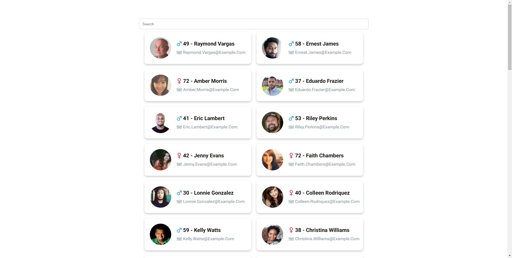

# 2) Creating a Stateful Component

## Create the component files

Create a new folder "ContactList" in our component directory and the css and associate file.
In the ContactList.js file add the following structure:

```javascript
import React, { Component } from 'react';
import './ContactList.css';

class ContactList extends Component {
    constructor(props) {
        super(props);
    }

    render() {
        return <div>
            LIST COMPONENT
        </div>
    }
}

export default ContactList;
```

This is the basic structure for a stateful component.


## Testing it out
First of all let's remove our testing data from App.js
Remove the SearchBar and the ContactCards components and add our new ContactList to app and check out if we see it on the browser

## Getting data
Get the mockData.json file (that is on the Resources folder in the repo). Add the file to the src folder inside the React application.

Let's get some mock data from our new mockData.json file we just added in the src folder.

This is just for testing out our state, real data will come from an API but until then we can simply mock it with adding 

```javascript
import * as rawData from './../../mockData.json';
const data = rawData.default.results;
```
in our ContactList.js component.

Now we have the list of contacts to render on screen! But first... a little bit about state

## Adding state
State is used to save data that changes, so when that data changes something on the screen changes too. What elements can change on a list that is being searched upon ? 

I'm going to say that the data changes and the query changes so let's add state into the mix

### Adding an initial state
In our ContactList class add a new object called state with query and contacts as parameters as follows: 

```javascript
    state = {
        query: "",
        contacts: data
    }
```

We modify the state using the setState method which will trigger a new rendering cycle (for display components if props change, that also triggers a new cycle)


### Using state to make the SearchBar "work"

Let's add the SearchBar in our ContactList component
We know our SearchBar takes 2 props:
* filterText - the text to display
* onUserInput - callback function that returns the user input

We can set our query from the state into the filterText prop (the text we are searching) and we need to create a function that handles the user input.

Let's create a handleSearch function that takes a string parameter and sets the new state

```javascript
handleSearch = (searchTerm) => {
    // here we need to set the state with our new searchTerm
}
```

### Testing it out
It works properly if we can type something in the SearchBar component
It now works because we are keeping the *state* of the query in the ContactList component and updating it with each change and passing the new string to the searchbar so it can display on screen.

## Rendering the contact cards

We need to parse the given list and render a contact card for each element of the list. We need to create a function that takes as input the contacts list and returns a list of JSX elements.

```javascript
renderContacts = (contacts) => {
    // map all contacts to a JSX element something like this:
    // contacts.map(contact => <ContactCard *props go here* />)
}
```

And now we can test out our function the render function like this:

```javascript
{this.renderContacts(this.state.contacts)}
```

## Recap
We have created a stateful component that has the possibility to modify it's state in order to control the child components via props. 

My list looks like this: 



## Next steps
Next up we'll link up to an API to see how Async affects the data flow and how we should proceed.